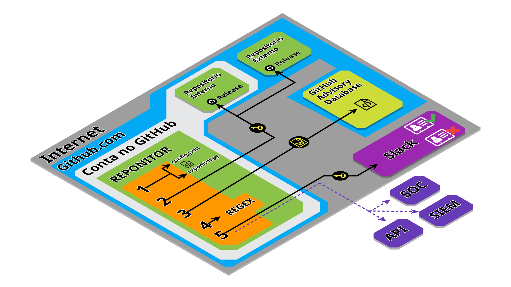

# **Reponitor**

> _**REPO**sitório + mo**NITOR**_ – Monitoramento automatizado de vulnerabilidades e versões em repositórios GitHub via Advisory DB.

O **Reponitor** é uma solução totalmente integrada ao ecossistema do GitHub, desenvolvida para monitorar vulnerabilidades em repositórios e forks do GitHub via **GitHub Actions** e **GitHub Advisory Database**.

A execução é toda via **GitHub Actions**, onde o workload python coletar informações sobre os repositorios diretamente da **GitHub Advisory Database**, eliminando a necessidade de infraestrutura adicional e verificações manuais.

A ferramenta centraliza o rastreamento de versões e alertas de segurança, enviando notificações detalhadas diretamente para um canal no **Slack** via webhook.

---

### 🚀 **Funcionalidades**

1. **Monitoramento de Vulnerabilidades:**
   - Faz scraping na página de advisories do GitHub para capturar informações como `CVEs`, IDs e datas de publicação.
   - Filtra vulnerabilidades com base em `intervalos de tempo` configuráveis.

2. **Controle de Releases e Forks:**
   - Consulta a API do GitHub para buscar as últimas releases de repositórios públicos e forks.
   - Exibe dados como o nome e a data da release mais recente.

3. **Notificação no Slack:**
   - Envia relatórios estruturados usando o `Slack Block Kit` via webhook.
   - Detalha vulnerabilidades encontradas ou informa sobre ausência delas.

4. **Configuração Flexível:**
   - Baseado em um arquivo JSON (`config.json`), permite fácil definição de repositórios monitorados e intervalos de busca.

5. **Execução via GitHub Actions:**
   - Execução direto no ambiente do github, sem necessidade de servidores ou infra adicional.
   - `(2000 minutos gratuitos por mês em repositórios privados)`

---

### 👀 **Passos Cronológicos de Execução do Reponitor**

   <p align="center">
     
   </p>

### 🔄 Etapas dos Passos Cronológicos do Pipeline

<details>
<summary><strong>1. Coleta dos Arquivos Configuracionais e de Código</strong></summary>

O pipeline começa ao obter os arquivos necessários (`config.json` e `securion.py`) do repositório configurado, utilizando a ação **actions/checkout@v4**.

- **Objetivo:**
  - Garantir que os arquivos de configuração e código essenciais sejam disponibilizados no ambiente de execução para os próximos passos do pipeline.

- **Detalhes Técnicos:**
  - A ação **actions/checkout@v4** realiza o clone do repositório.
  - `config.json` fornece os parâmetros dinâmicos como escopo de tempo e repositórios.
  - `securion.py` contém a lógica principal do monitoramento.

</details>

<details>
<summary><strong>2. Coleta de Informações sobre Releases</strong></summary>

Após obter os arquivos, o script coleta informações sobre as releases mais recentes dos repositórios configurados, utilizando o token armazenado em `secrets.GH_PAT`.

- **Objetivo:**
  - Obter datas e versões das últimas releases dos repositórios público e fork.
  - Avaliar a necessidade de sincronizações baseando-se nas datas.

- **Detalhes Técnicos:**
  - Requisições autenticadas à API de releases do GitHub.
  - Quando não há release, uma mensagem de ausência é exibida: `(Release não encontrada)`.

</details>

<details>
<summary><strong>3. Busca de Advisories no GitHub</strong></summary>

Requisição pública simulando um navegador para acessar a página de advisories do GitHub.

- **Objetivo:**
  - Consultar vulnerabilidades relacionadas aos repositórios configurados.

- **Detalhes Técnicos:**
  - A busca é direcionada ao repositório público.
  - Dados em HTML bruto são processados no passo seguinte para extração estruturada.

</details>

<details>
<summary><strong>4. Filtragem Temporal de Vulnerabilidades (Regex + Timestamp)</strong></summary>

Identificação de vulnerabilidades relevantes com base no escopo temporal definido.

- **Agrupamento com Regex:**
  - Extração de:
    - IDs de advisories
    - CVEs
    - Datas de publicação

- **Verificação Temporal:**
  - Conversão do intervalo definido (`days`, `hours`, `minutes`, `seconds`) em segundos.
  - Advisories fora do intervalo são descartados.

</details>

<details>
<summary><strong>5. Envio de Alertas ao Slack</strong></summary>

As notificações são enviadas ao canal do Slack via webhook.

- **Objetivo:**
  - Informar rapidamente a equipe sobre novas vulnerabilidades ou discrepâncias de releases.

- **Detalhes Técnicos:**
  - Utiliza `secrets.SLACK_WEBHOOK_URL`.
  - A mensagem inclui IDs, CVEs e links diretos para advisories relevantes.

Dois tipos de relatórios podem ser gerados:  

1. **Alerta com Vulnerabilidades:**  
   - Lista as vulnerabilidades encontradas no escopo de tempo pesquisado.  
   - Inclui detalhes como:  
     - IDs e CVEs das vulnerabilidades.  
     - Data de publicação.  
     - Tempo desde a publicação (em dias, horas, minutos, segundos).  
   - Adiciona as datas das releases dos repositórios público e fork, permitindo uma visão comparativa.  

2. **Alerta Sem Vulnerabilidades:**  
   - Informa que a verificação foi realizada, mas nenhuma vulnerabilidade foi encontrada.  
   - Exibe o escopo de tempo pesquisado para dar contexto.  
   - Inclui as informações sobre as releases dos repositórios.  

</details>

---

### 📦 Como configurar (config.json, secrets e agendamento)

#### ⚙️ **Configuração do Arquivo `config.json`**

O arquivo `config.json` é a base para a parametrização dinâmica do Securion, permitindo definir repositórios a serem monitorados e o escopo temporal para a busca de vulnerabilidades.

Cada chave e valor do arquivo tem um propósito específico, conforme descrito abaixo:

##### 📖 **Exemplo de Arquivo config.json**

No exemplo abaixo vamos monitorar os repositórios **open-webui/open-webui** e o **hacksider/Deep-Live-Cam** (incluindo forks) buscando vulnerabilidades no ultimo dia.

```json
{
  "repository_pairs": [
    {"public": "open-webui/open-webui", "fork": "usrbinbrain/open-webui"},
    {"public": "hacksider/Deep-Live-Cam", "fork": "usrbinbrain/Deep-Live-Cam"}
  ],
  "search_range": {
    "days": 1,
    "hours": 0,
    "minutes": 0,
    "seconds": 0
  }
}
```

##### 📖 Descrição dos Campos do Arquivo `config.json`

<details>
<summary><strong>1. <code>repository_pairs</code></strong></summary>

Representa a lista de pares de repositórios a serem monitorados.

- Cada par contém dois campos:
  - **`public`**: Define o repositório público do qual serão coletadas informações de advisories e releases.  
    Exemplo: `"open-webui/open-webui"`
  - **`fork`**: Representa o fork associado ao repositório público.  
    Este campo é usado para comparar a sincronização entre o repositório original e o fork, fornecendo insights sobre a necessidade de atualizações.

</details>

<details>
<summary><strong>2. <code>search_range</code></strong></summary>

Define o intervalo de tempo para a busca de vulnerabilidades nos advisories do GitHub.

- Composto por quatro campos:
  - **`days`**: Número de dias a serem considerados no escopo da busca.
  - **`hours`**: Número de horas a serem consideradas.
  - **`minutes`**: Número de minutos a serem considerados.
  - **`seconds`**: Número de segundos a serem considerados.

</details>

#### ⚙️ **Configuração de Repository Secrets no GitHub**

> ⚠️ Certifique-se de que os nomes estejam exatamente como descrito abaixo, pois o [workflow do GitHub Actions](.github/workflows/main_schedule.yml) depende dessas identificações para funcionar corretamente.

1. Acesse seu repositório forkado no GitHub.
2. Vá em **Settings > Secrets and variables > Actions > New repository secret**.
3. Crie os seguintes secrets:

   * `GH_PAT` com o valor do seu token de acesso pessoal.
   * `SLACK_WEBHOOK_URL` com a URL do seu webhook do Slack.
  
#### 📖 Sobre os Repository Secrets

<details>
<summary><strong>1. <code>GH_PAT</code></strong></summary>

- **Descrição**: Token de acesso pessoal (_Personal Access Token_) com permissões mínimas para leitura de repositórios privados e acesso à API do GitHub.  
- **Uso**: Autentica as chamadas do script Python à GitHub API, garantindo que o monitoramento de advisories e releases ocorra mesmo em repositórios privados ou com limites mais restritos.  
- **Recomendação**: [Gere o token](https://docs.github.com/pt/enterprise-cloud@latest/authentication/keeping-your-account-and-data-secure/managing-your-personal-access-tokens#como-criar-um-fine-grained-personal-access-token) com o escopo `repo` (somente leitura) e defina uma expiração curta para segurança adicional.

</details>

<details>
<summary><strong>2. <code>SLACK_WEBHOOK_URL</code></strong></summary>

- **Descrição**: URL de webhook fornecida pelo Slack para envio de mensagens a um canal específico.  
- **Uso**: Utilizada para enviar notificações automatizadas de vulnerabilidades e novas versões diretamente para sua equipe.  
- [Criando um webhook no Slack](https://slack.com/marketplace/A0F7XDUAZ-incoming-webhooks)

</details>

#### ⚙️ **Configuração de Agendamento para Execução via GitHub Actions**

O Reponitor é executado de forma [agendada utilizando um workflow](.github/workflows/main_schedule.yml#L4) **GitHub Actions**, o que permite que a análise de vulnerabilidades e releases ocorra em ciclos periódicos e sem intervenção manual. 

A execução programada é definida com a diretiva `schedule`, que usa a sintaxe `cron`. No exemplo abaixo, o workflow será executado todos os dias às 01:00 da manhã (UTC):

```yaml
on:
  schedule:
    - cron: '0 1 * * *' # Executa diariamente às 01:00 UTC
```

> 💡 **Dica:** Você pode [personalizar a frequência de execução](https://docs.github.com/pt/actions/using-workflows/events-that-trigger-workflows#schedule) ajustando o valor de `cron` no workflow.

---